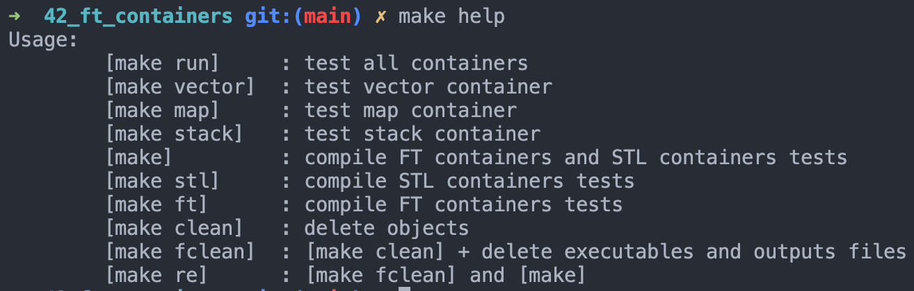
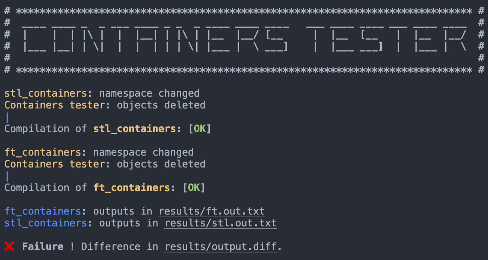

# FT_CONTAINERS (@42Paris)
*"The multiple available containers in C++ all have very different usage. To make sure you understand them, let’s re-implement them!"*

## Objective

The objective of this project is to implement the various container types of the C++ standard template library.

## Usage
```
$ git clone https://github.com/adbenoit-9/42_ft_containers.git
$ cd 42_ft_containers/
$ make help
```


### Execution
```
$ make run
```

## Preview

